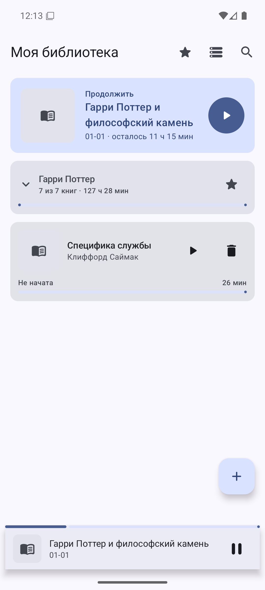
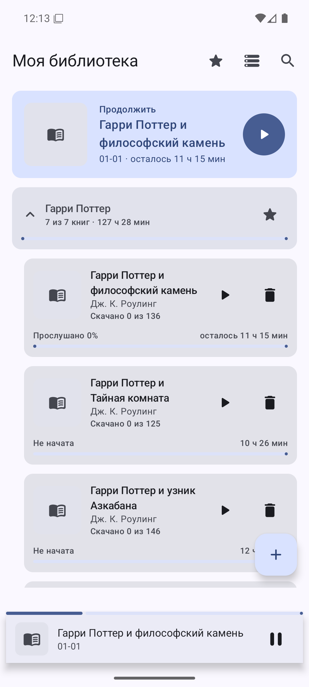
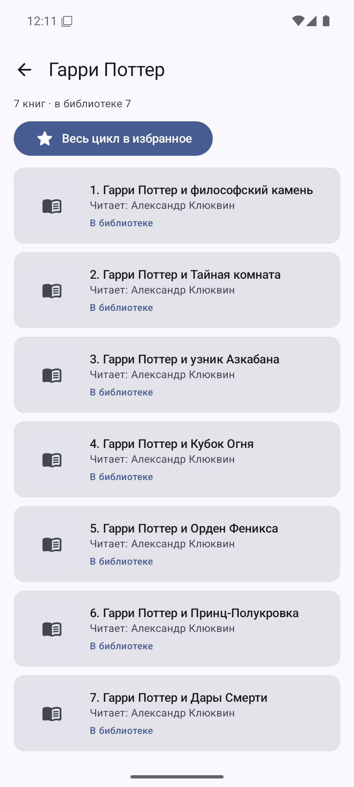
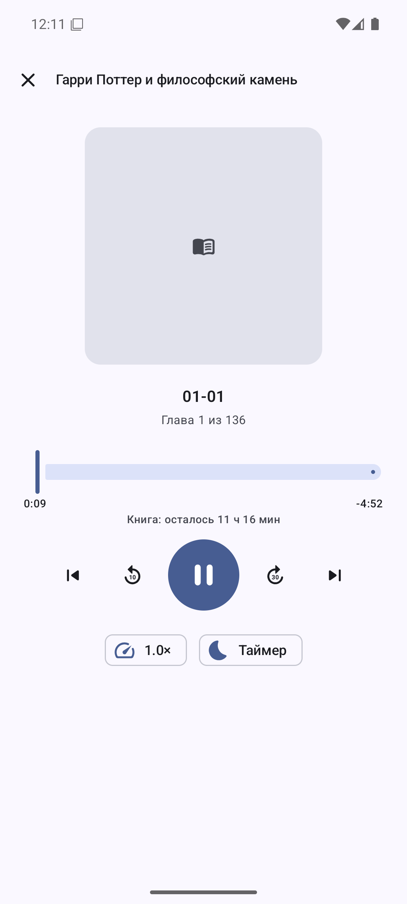
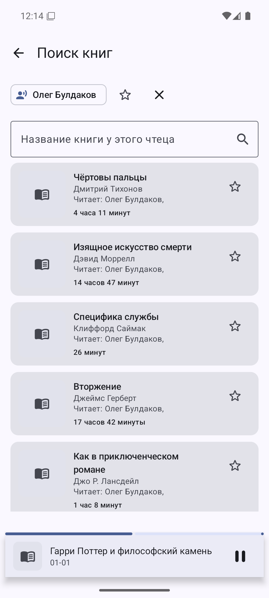
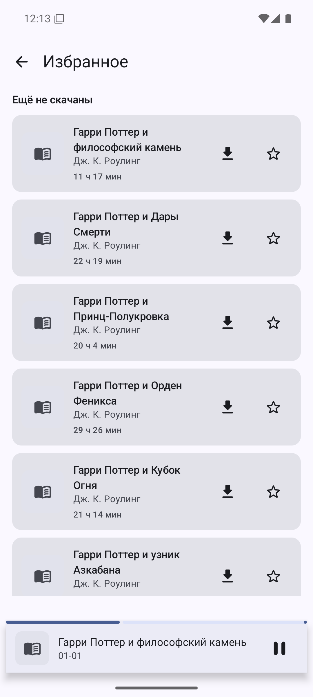
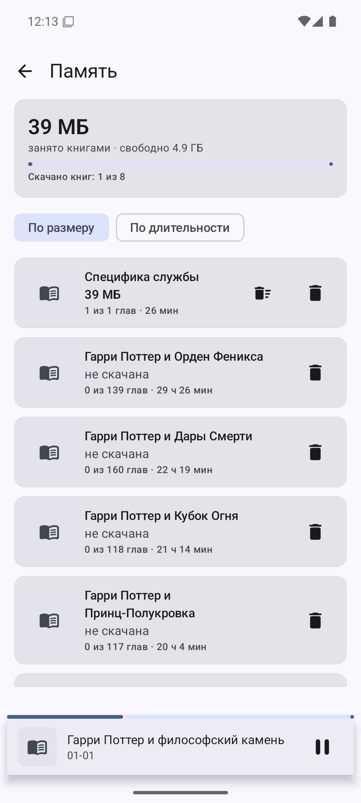

# Книга в ухе

Плеер аудиокниг для Android и iOS, работающий поверх сайта knigavuhe.org: вставляешь ссылку на
книгу, приложение забирает список глав, скачивает их и дальше играет офлайн — с фоновым
воспроизведением, скоростью, таймером сна и отдельной позицией у каждой книги.

У сайта нет своего приложения, только веб-версия. Это попытка сделать то, чего не хватало:
нормальный плеер с офлайном и памятью о том, где ты остановился.

> **Личный проект, а не продукт.** Сайт помечает книги как `downloadable: false` и
> `offline_allowed: false` — приложение эти флаги не соблюдает. Права на сами книги принадлежат
> правообладателям, и скачанные файлы никуда, кроме своего телефона, отправлять не стоит. В сторы
> это не выкладывается и выкладываться не должно.

На скриншотах обложки заменены заглушками: чужую обложечную графику в репозитории держать незачем.

## Что умеет

| | |
|---|---|
| **Импорт по ссылке** | Вставил адрес книги или поделился им из браузера — приложение достаёт метаданные и список глав |
| **Поиск и каталог** | Поиск по сайту, страницы автора, чтеца, жанра и цикла прямо в приложении |
| **Фильтр по чтецу** | Выбираешь чтеца и ищешь книги в его каталоге по названию. Любимый чтец подставляется сам |
| **Скачивание** | Главы качаются в три потока с докачкой, прогресс в уведомлении, файлы живут офлайн |
| **Плеер** | Media3 на Android, AVQueuePlayer на iOS: фон, экран блокировки, гарнитура, скорость, перемотка 10/30 секунд |
| **Позиция у каждой книги** | Переключился на другую и вернулся — продолжаешь с той же секунды. Карточка «Продолжить» в один тап |
| **Таймер сна** | 15/30/45/60 минут или до конца главы, с плавным затуханием |
| **Циклы** | Книги серии собираются в блок, видно номер книги, дослушал — предложит следующую |
| **Избранное** | Отложенные книги, которые ещё не качал |
| **Память** | Сколько занимает каждая книга, сортировка по размеру и длительности, удаление в два тапа |

## Как выглядит

| Библиотека | Цикл в библиотеке | Экран цикла |
|---|---|---|
|  |  |  |

| Плеер | Поиск по чтецу | Избранное | Память |
|---|---|---|---|
|  |  |  |  |

Управление с экрана блокировки и из шторки работает через MediaSession на Android и
`MPNowPlayingInfoCenter` на iOS: пауза, соседние главы, перемотка и живая полоса прогресса.

## Как устроен сайт

Самое ценное здесь не код, а разобранный формат данных. Подробности:
[android/README.md](android/README.md).

Коротко:

- `GET /ajax/book_data/<id>/` отдаёт метаданные и плейлист. Ответ — **массив из двух элементов**
  `[ошибка, данные]`, разбирать надо второй; ошибка приходит в первом, а не кодом HTTP.
- Аудио лежит обычными mp3 на CDN сайта, с поддержкой `Range` и без проверки Referer.
- Хэш в пути mp3 ротируется примерно раз в 66 часов (`url_refresh`), поэтому ссылки в базе надо
  обновлять — скачанные файлы это не трогает.
- Поиска по API нет, листинги парсятся из HTML. Разметка различается по User-Agent: на десктопном
  хосте `div.bookkitem`, на мобильном `span.bookkitemm` с другой раскладкой мета-блоков.
- Идентификатор книги не всегда есть в адресе: у части книг адрес чисто словесный, и id приходится
  доставать со страницы.
- У книг, права на которые ушли в ЛитРес, вместо глав приходит одна заглушка нулевой длины со
  ссылкой на их магазин. Такие приложение показывает отдельно и не пытается качать.

## Сборка

### Android

```bash
cd android
./gradlew :app:assembleDebug
```

APK окажется в `android/app/build/outputs/apk/debug/`. Нужны JDK 17+ и Android SDK 37.
Тесты парсеров: `./gradlew :app:testDebugUnitTest`.

### iOS

Собирается только на macOS с Xcode. Проект генерируется XcodeGen'ом из `ios/project.yml`:

```bash
cd ios
xcodegen generate
xcodebuild -scheme KnigaVUhe -destination "generic/platform=iOS" build
```

Подробности, включая сборку неподписанного `.ipa` и варианты подписи —
[ios/README.md](ios/README.md).

## Что внутри

```
android/   Kotlin, Compose, Media3, Room, WorkManager, OkHttp, Jsoup
ios/       Swift, SwiftUI, AVFoundation, URLSession, SwiftSoup
docs/      Скриншоты
```

Общего кода между платформами нет: переезжает только знание формата данных сайта. Android-версия
полнее, iOS повторяет основной набор функций.

## Чего не умеет

- Не синхронизирует позицию между устройствами: всё живёт на телефоне.
- Не подписан релизным ключом, ставится сборкой для отладки.
- Разметка сайта не контрактная: поменяют классы карточек — поиск отвалится. Симптом узнаваемый:
  HTTP 200 и ноль результатов.
